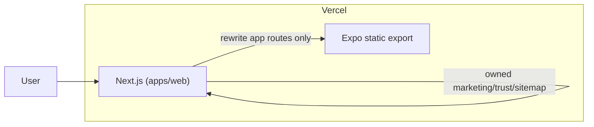

# AvoVibe Technical SEO Baseline

## Route Ownership (Next.js vs Expo) – Non-breaking Contract

Define explicitly which routes each layer serves. **No overlap: any route owned by Next must not be served by the SPA, and vice versa.**

**1) Next.js (SEO/marketing) owns these public routes:**

- `/`
- `/calorie-tracker`
- `/macro-tracker`
- `/protein-tracker`
- `/fiber-tracker`
- `/water-tracker`
- `/free-calorie-tracker` (and other programmatic marketing slugs)
- `/about`
- `/contact`
- `/privacy`
- `/terms`
- `/security`
- `/p/*` (programmatic SEO pages)
- `/robots.txt`
- `/sitemap.xml` and all `/sitemap-*.xml`
- `/opengraph-image` and `/twitter-image` routes (or their Next equivalents)

**2) Expo SPA (app/private) owns these routes:**

- `/login`
- `/signup`
- `/auth/*`
- `/onboarding/*`
- `/settings/*`
- `/account/*`
- `/app/*`
- Tab routes and logged-in experiences (e.g. dashboard, mealtype-log, exercise, water, weight, friends, explore, more, inbox, support, legal viewer, etc.)

---

## Vercel Routing & Rewrites (Critical – Prevent Breakage)

**Rule: Do NOT rewrite all paths to the SPA.** That would send marketing and SEO routes to the app and break crawlability and deep links.

**Concrete approach:**

1. **Let Next handle its owned routes** – No rewrite needed; they are real Next routes (pages or route handlers).
2. **Rewrite only app routes to the SPA** – For paths that belong to Expo (login, auth, onboarding, settings, tabs, etc.), rewrite to the SPA artifact (e.g. the Expo-built `index.html` or the directory that serves it).

**Sample rewrite strategy (plan-only, not final code):**

- **Marketing routes** (/, /about, /calorie-tracker, /p/*, etc.) → served by Next.js; no rewrite.
- **App routes** (e.g. /login, /auth/*, /onboarding/*, /settings/*, tab and logged-in paths) → rewrite to the SPA output so the Expo app loads and client-side routing takes over.

**Risk callout:** Incorrect rewrite order or “rewrite everything to SPA” can cause users to land on marketing pages instead of the app, or break deep links (e.g. auth callbacks). Configure rewrites so that Next is the default handler and only the explicit app-route list is rewritten to the SPA.

---

## “Minimum Break Risk” Variant (Recommended for First Release)

- **Preserve existing legal URLs** if they already exist in the app (e.g. `/legal/privacy`, `/legal/terms`, `/legal/health`). These stay owned by the Expo SPA; do not move them to Next without a clear migration.
- **Option A (preferred):** Keep `/legal/*` served by the SPA (unchanged). For SEO, add Next.js pages at `/privacy` and `/terms` that either:
  - **301/302 redirect** to the canonical existing URLs (`/legal/privacy`, `/legal/terms`), or
  - **Render the same content** (e.g. from a shared source) with canonical tags pointing to the chosen canonical URL.
- **Canonical:** Ensure canonical tags point to the single preferred URL to avoid duplicate content (either `/legal/privacy` or `/privacy`, but not both as canonical).

---

## Robots + Sitemaps – Avoid Duplicate Implementations

**Guardrails:**

- **Robots:** Choose **exactly one** approach:
  - Next.js metadata route (`app/robots.ts`), **or**
  - Static `public/robots.txt`.
- **Sitemap:** Choose **exactly one** approach:
  - Custom XML route handlers (e.g. `app/sitemap.xml/route.ts` and part sitemaps), **or**
  - Next’s built-in sitemap helper (e.g. `app/sitemap.ts`).
- **Disallow rules** must match app/private routes and must **not** block marketing pages (e.g. do not disallow `/`, `/about`, `/p/*`, or sitemap URLs).

---

## Current State

- **Stack**: Expo (expo-router) with `expo export --platform web`; Vercel builds to `dist` and rewrites all non-api routes to `index.html` ([vercel.json](vercel.json)).
- **No Next.js**: No `app/layout.tsx`, no Metadata API, no route handlers. HTML shell is in [app/+html.tsx](app/+html.tsx) (lang, viewport, favicons only; no meta description, OG, canonical, or JSON-LD).
- **Legal**: Terms/privacy/health at `/legal/terms`, `/legal/privacy`, `/legal/health` via [app/legal/[docType].tsx](app/legal/[docType].tsx); content from [legal/](legal/) and i18n.
- **Brand**: AvoVibe and domain `https://avovibe.app` are used in [apps/native](apps/native), [constants/links.ts](constants/links.ts) (support: `avovibeapp@gmail.com`), and i18n. No existing sitemap, robots, or OG tags.

## Architecture: Add Next.js for SEO

These features require the Next.js marketing layer; **Expo alone cannot provide** per-route metadata, dynamic metadata routes, dynamic sitemaps, or `next/og`. **Expo remains the logged-in product; Next is the crawlable public shell.**

- Add a **Next.js app** (e.g. `apps/web`) as the public/SEO layer at `https://avovibe.app`.
- Next.js serves all routes listed in **Route Ownership** above.
- Expo SPA serves all app/private routes via rewrites (see **Vercel Routing & Rewrites**).

---

## 1) Single source of truth: `/lib/seo/site.ts`

**Location**: In the Next.js app (e.g. `apps/web/lib/seo/site.ts`), or at repo root `lib/seo/site.ts` if you want to share with Expo later.

**Contents** (conceptual):

- `siteName = "AvoVibe"`
- `domain = "https://avovibe.app"`
- `titleDefault`, `descriptionDefault` (as specified)
- `twitterHandle` (optional, empty ok)
- `ogImage = \`${domain}/og.png\``
- `keywords` (short array)
- Optional `brandColors`

No existing SEO constants to refactor; [constants/links.ts](constants/links.ts) and [constants/theme.ts](constants/theme.ts) can be referenced for support email and colors if needed.

---

## 2) Global metadata and canonical (Next.js)

**File**: Next.js root layout, e.g. `apps/web/app/layout.tsx`.

- **metadataBase**: `new URL(domain)` from `lib/seo/site`.
- **title**: template `"%s | AvoVibe"`, default from site.ts.
- **description**: default from site.ts.
- **robots**: `index: true`, `follow: true`; `googleBot`: `index`, `follow`, `max-image-preview: "large"`.
- **openGraph**: `type: "website"`, url, siteName, title, description, images (use `ogImage`).
- **twitter**: card `summary_large_image`.
- **alternates.canonical**: default to domain root.
- **themeColor** and **html lang="en"** (layout wraps with `<html lang="en">`).

Each page can override title/description via `generateMetadata` or export `metadata`.

---

## 3) JSON-LD (invisible structured data)

- **`lib/seo/jsonld.ts`** (in Next app): Export functions that return plain objects for:
  - **SoftwareApplication** (AvoVibe as health app)
  - **Organization** (AvoVibe)
  - **WebSite** (optional **SearchAction** only if you have a search endpoint)
- **`components/SeoJsonLd.tsx`**: Accept `schema` (object or array), render `<script type="application/ld+json">` with `JSON.stringify(schema)` (no unsafe HTML).
- **Root layout**: Render Organization + WebSite JSON-LD once.
- **Landing pages** (e.g. home, `/calorie-tracker`): Add SoftwareApplication JSON-LD.

---

## 4) robots.txt (block index dilution)

**File**: `apps/web/app/robots.ts` (Next.js Metadata Route) **or** static `public/robots.txt` – use **one** approach only (see **Robots + Sitemaps**).

- **Allow**: `/`
- **Disallow**: `/auth`, `/login`, `/signup`, `/onboarding`, `/settings`, `/account`, `/api`, `/_next`, and any `/debug`, `/preview`, `/test` if present.
- **Sitemap**: `https://avovibe.app/sitemap.xml`

---

## 5) Multi-sitemap architecture (index + parts)

Use **either** custom XML route handlers **or** Next’s built-in sitemap helper – **one** approach only (see **Robots + Sitemaps**). All under the Next.js app; correct `Content-Type: application/xml; charset=utf-8` and cache headers.

- **Sitemap index** listing: `sitemap-main.xml`, `sitemap-features.xml`, `sitemap-pages.xml`, `sitemap-programmatic.xml` with `<loc>` and `<lastmod>`; use `xmlEscape` for safety.
- **sitemap-main.xml**: Homepage, pricing, download (if routes exist), core entry pages; absolute URLs; `lastmod` e.g. `new Date().toISOString()`.
- **sitemap-features.xml**: `/calorie-tracker`, `/macro-tracker`, `/protein-tracker`, `/fiber-tracker`, `/water-tracker`, and only if public: `/exercise-log`, `/food-diary`, `/community`.
- **sitemap-pages.xml**: `/about`, `/contact`, `/privacy`, `/terms`, `/security`.
- **sitemap-programmatic.xml**: Populate from programmatic slug list; initially valid empty `<urlset>` or placeholders. All URLs absolute.

---

## 6) Open Graph and Twitter images

- **`app/opengraph-image.tsx`**: Use `next/og` (ImageResponse) for a simple branded card: “AvoVibe” + tagline “Free Calorie & Macro Tracker”.
- **`app/twitter-image.tsx`**: Same for Twitter card.
- Optionally add **`/public/og.png`** as static fallback when brand assets exist.

---

## 7) Trust / E-E-A-T pages (indexable, lightweight)

Create **static, public** Next.js pages:

- `app/about/page.tsx`
- `app/contact/page.tsx`
- `app/privacy/page.tsx`
- `app/terms/page.tsx`
- `app/security/page.tsx`

Each: unique **metadata** (title, description); **H1** and structured **H2**; concise, real content (product + contact). Align with **Minimum Break Risk** (e.g. `/privacy` and `/terms` redirect or mirror canonical `/legal/*` if desired).

---

## 8) Programmatic SEO framework (future-scale, safe now)

- **`lib/seo/programmatic.ts`**: Array of 10–20 entries (e.g. `/free-calorie-tracker`, `/macro-tracker-app`, `/track-protein`, …) with `slug`, `title`, `description`, `h1`, 3–6 bullet benefits, optional FAQ items.
- **Route**: `app/p/[slug]/page.tsx` with **generateStaticParams**, **generateMetadata**, canonical, JSON-LD (WebPage; FAQPage when FAQs exist). Content 300–600 words, unique per page.
- **sitemap-programmatic.xml**: Include all programmatic URLs (absolute, lastmod).

---

## 9) Internal linking (crawlable)

- **Footer or “Explore” section** (Next.js marketing/trust pages): Crawlable `<a href="...">` to Calorie Tracker, Macro Tracker, Protein Tracker, Fiber Tracker, Water Tracker, Privacy, Terms, and optionally Security, About, Contact. Use root-relative or absolute URLs, not only buttons.

---

## 10) Page quality rules (avoid penalties)

- No keyword stuffing; no hidden text.
- App-private paths out of sitemap and disallowed in robots.
- Marketing and trust pages server-rendered (SSG/SSR) in Next.js, not client-only.

---

## 11) Verification and submission

- **Env vars** (optional): `NEXT_PUBLIC_GOOGLE_SITE_VERIFICATION`, `NEXT_PUBLIC_BING_SITE_VERIFICATION`.
- **Root layout**: If set, inject verification meta tags (e.g. `google-site-verification`, `msvalidate.vector`).
- Prefer DNS verification where possible; code supports meta-tag injection when env is set.

---

## Rollout Plan (Preview → Prod) + Fast Rollback

**Preview validation (must pass before prod):**

- Visit key **marketing** pages: `/`, `/calorie-tracker`, `/about`, `/privacy`, `/terms`.
- Visit key **app** deep links: `/login`, a logged-in route (e.g. dashboard), and auth callback paths (e.g. `/auth/callback`).
- Verify:
  - `robots.txt` reachable and correct (disallow app routes; allow marketing).
  - Sitemap index reachable and valid XML.
  - Each sitemap part valid XML with absolute URLs.
  - Page source on marketing pages includes canonical, OG/Twitter, JSON-LD.
  - `noindex` is **not** applied to marketing pages.
  - App/private routes are disallowed in robots and not in sitemaps (as intended).

**Rollback strategy:**

- Keep previous deployment available (e.g. Vercel “Promote to Production” from last good deployment).
- If issues: revert rewrites to prior behavior or redeploy previous build.
- Keep the first launch change set small and reversible.

---

## Deliverables and QA (Acceptance Criteria)

**Deliverables summary:**

| Item | Deliverable |
|------|-------------|
| 1 | `lib/seo/site.ts` with siteName, domain, titleDefault, descriptionDefault, ogImage, keywords, optional brand colors |
| 2 | Next.js root layout with metadataBase, title template, defaults, robots, openGraph, twitter, canonical, themeColor, lang |
| 3 | `lib/seo/jsonld.ts` (SoftwareApplication, Organization, WebSite); `SeoJsonLd.tsx`; layout + landing pages use JSON-LD |
| 4 | Single robots implementation (Next `app/robots.ts` or static `public/robots.txt`) with allow/disallow and sitemap URL |
| 5 | Single sitemap approach: index + four part sitemaps with correct Content-Type and absolute URLs |
| 6 | `app/opengraph-image.tsx` and `app/twitter-image.tsx` (next/og); optional `/public/og.png` |
| 7 | Five trust pages: about, contact, privacy, terms, security (metadata, H1/H2, concise content); align with Minimum Break Risk for legal |
| 8 | `lib/seo/programmatic.ts` + `app/p/[slug]/page.tsx` with generateStaticParams, generateMetadata, canonical, JSON-LD; programmatic URLs in sitemap |
| 9 | Footer or Explore section with crawlable links to trackers and legal/trust pages |
| 10 | No stuffing/hidden text; private app paths disallowed; marketing/trust SSG/SSR |
| 11 | Optional verification meta tags from env in layout |
| 12 | QA and rollout steps documented |

**Explicit acceptance criteria:**

- **No change to logged-in UX**: Dashboard, logging, friends, settings, tabs, etc. behave as before.
- **Deep link auth callback** continues to work (e.g. `/auth/callback` and OAuth flows).
- **SPA routes** still load and client-side navigation works for app-owned routes.
- **Only marketing/trust routes** change visibly (new or updated pages); app routes remain SPA.
- **Search console**: Document submission steps for Google Search Console and Bing Webmaster Tools (submit sitemap URL, optional verification via meta or DNS).

**QA checklist (run locally / on preview):**

- `curl` (or browser) `robots.txt` and `sitemap.xml`; validate each sitemap part (XML, absolute URLs).
- View page source on key pages: canonical, OG/Twitter, JSON-LD present; noindex not on marketing pages.
- Lighthouse: LCP/CLS acceptable; no blocking fonts if possible.

---

## Implementation Order

1. **Rewrites safety** – Configure Vercel/Next so Next owns its routes and only app routes rewrite to the SPA; validate app deep links and login/auth.
2. **Robots + sitemaps** – Implement one robots approach and one sitemap approach; validate XML and disallow rules.
3. **Metadata + JSON-LD** – Root layout defaults, canonical, OG/Twitter, SeoJsonLd and Organization/WebSite/SoftwareApplication.
4. **Programmatic pages** – Programmatic list, `/p/[slug]` page, sitemap-programmatic entries.
5. **Internal links** – Footer/Explore with crawlable links to trackers and trust pages.

All new SEO files live in the **Next.js app** (e.g. `apps/web`). No broken routes; sitemaps return correct Content-Type and absolute URLs; programmatic pages listed in sitemap-programmatic.
